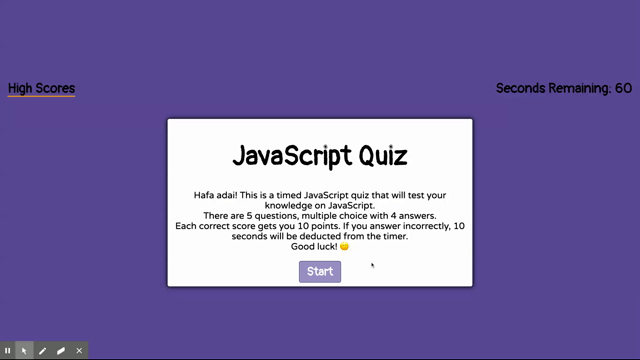

# JavaScript Quiz

This repo is a quiz built using only HTML, CSS, and vanilla JavaScript.

### Take the quiz here: [JavaScript Quiz](https://corgimaman.github.io/jsquiz/)

Credits to helping create this code are owed to Web Dev Simplified on YouTube.

## How to Use
To take the test, visit the site and press start. You have 60 seconds to answer 5 multiple choice questions about JavaScript. Each question is worth 10 points and wrong answers deduct 10 seconds from the timer. The scores are saved to your local storage, so to compare your scores to others, they will need to take the test on the same computer and browser. To reset scores, you can clear your local storage, or press the reset button on the [High Scores page](https://corgimaman.github.io/jsquiz/highscores.html).

## What I Learned

In doing this assignment, I learned to use functions of JavaScript such as creating a timer, on click events, and use the elements from the HTML to display content and change based on events (such as when the screen and buttons change to green and red). 